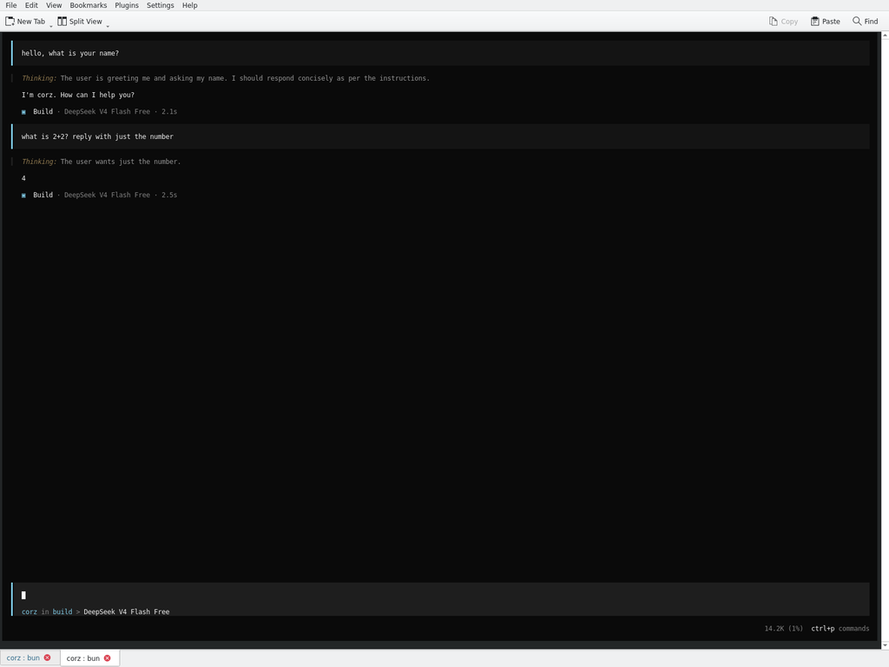
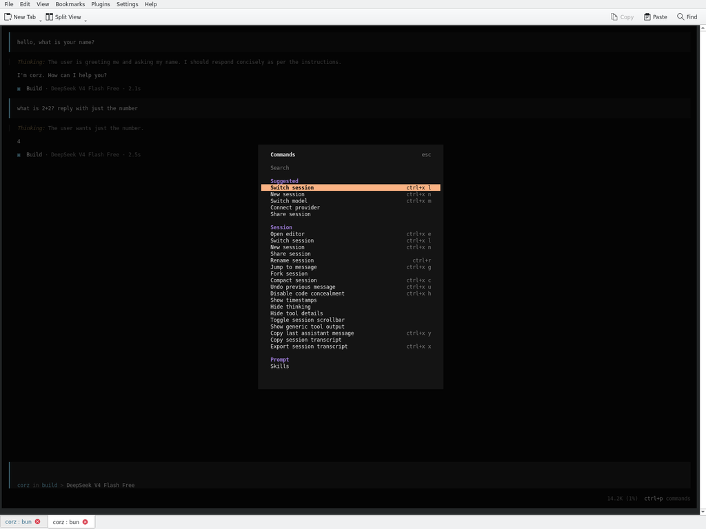

<p align="center">
  
</p>

<h1 align="center">Corz</h1>
<p align="center"><strong>Agentic AI Coding Terminal</strong></p>
<p align="center">
  An AI-powered coding agent that lives in your terminal. Write, debug, and ship code through natural conversation.
</p>

<p align="center">
  <a href="https://www.npmjs.com/package/corz"></a>
  <a href="https://github.com/comedynyaxo/corz-cli"></a>
  <a href="https://github.com/comedynyaxo/corz-cli/blob/main/LICENSE"></a>
</p>

---

## Demo

https://github.com/user-attachments/assets/corz-demo.mp4

<video src=".github/assets/corz-demo.mp4" width="800" controls></video>

> A short demo showing Corz responding to prompts in the terminal — AI-powered coding, right where you work.

---

## What is Corz?

Corz is an agentic AI coding terminal that brings powerful language models directly into your command line. Instead of switching between your editor, browser, and chat windows, you talk to Corz in your terminal and it writes, edits, and debugs code for you.

**Key capabilities:**

- **Conversational coding** — describe what you want in plain English and Corz writes the code
- **File operations** — reads, creates, and edits files in your project
- **Shell execution** — runs commands, installs dependencies, and manages your dev environment
- **Multi-model support** — works with multiple AI providers and includes free models out of the box
- **Context-aware** — understands your entire codebase and project structure

---

## Installation

```bash
npm install -g corz
```

Then start it:

```bash
corz
```

That's it. Corz launches an interactive terminal UI where you can start coding with AI immediately.

---

## Agents

Corz includes two built-in agents. Switch between them with the `Tab` key.

### Build Mode


The default agent with full access for development work. It can read and write files, run shell commands, and make changes to your codebase.

### Plan Mode


A read-only agent for analysis and exploration. It reads files and understands your code but won't make changes — ideal for exploring unfamiliar codebases or planning your next move before building.

---

## Command Palette

Press `Ctrl+P` to open the command palette with quick access to all features.



Available commands include:

| Command | Shortcut | Description |
|---------|----------|-------------|
| Switch session | `Ctrl+X L` | Jump between active sessions |
| New session | `Ctrl+X N` | Start a fresh conversation |
| Switch model | `Ctrl+X M` | Change the AI model |
| Switch agent | `Ctrl+X A` | Toggle between build and plan |
| Open editor | `Ctrl+X E` | Open your code editor |
| View status | `Ctrl+X S` | Check connection and usage |
| Compact session | `Ctrl+X C` | Compress session history |

---

## Free Models

Corz comes with free AI models — no API key required. Just install and start coding:

- **Big Pickle** (Free)
- **DeepSeek V4 Flash Free** (Free)
- **MiniMax M2.5 Free** (Free)
- **Nemotron 3 Super Free** (Free)
- **Ring 2.6 1T Free** (Free)

Want to use your own API key? Connect any OpenAI-compatible provider, Anthropic, Google, or other supported providers through the settings.

---

## Session Screenshot

<p align="center">
  
</p>

> Corz running in build mode — the AI responds with thinking visible, showing the model used and response time.

---

## Configuration

Corz stores its configuration in `~/.config/corz/`. The TUI automatically detects and uses your terminal's native color scheme — no theme configuration needed.

### Slash Commands

Type `/` in the prompt to access slash commands for quick actions like switching models, managing sessions, and more.

### Keyboard Shortcuts

| Key | Action |
|-----|--------|
| `Tab` | Switch between build and plan mode |
| `Ctrl+P` | Open command palette |
| `Ctrl+C` | Interrupt current response |
| `Ctrl+R` | Rename session |
| `Enter` | Send message |
| `Esc` | Cancel / go back |

---

## Development

Requirements: [Bun](https://bun.sh) 1.3+

```bash
# Clone the repository
git clone https://github.com/comedynyaxo/corz-cli.git
cd corz-cli

# Install dependencies
bun install

# Start the development server
bun dev
```

### Project Structure

```
packages/
  corz/       # Core CLI — business logic, TUI, server
  app/        # Web UI components (SolidJS)
  desktop/    # Desktop app (Electron)
  plugin/     # Plugin SDK (@corz-ai/plugin)
  core/       # Shared core utilities
  llm/        # LLM provider integrations
  ui/         # Shared UI component library
```

---

## Contributing

See [CONTRIBUTING.md](./CONTRIBUTING.md) for development setup, coding standards, and PR guidelines.

---

## License

[MIT](./LICENSE)
